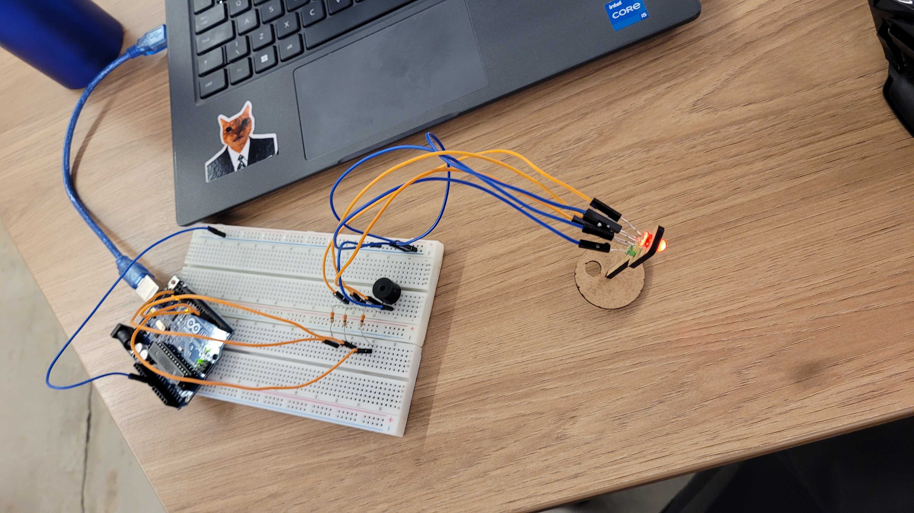

# Ponderada - Semáforo offline

Nessa atividade, foi desenvolvido uma montagem de um semáforo, utilizando arduíno UNO, uma protoboard, LED vermelho, amarelo e verde, 3 jumpers macho-macho e 3 macho-fêmea laranjas (não havia jumpers vermelhos), jumpers macho-fêmea azuis, um macho-macho azul, um buzzer e 3 resistores de 330 ohms. A  montagem foi feita conectando corretamente os jumpers em suas posições específicas e conectadas nas saídas digitais 12, 4 e 2 do arduíno.


## Tabela de componentes
| Componente                | Quantidade | 
|---------------------------|------------|
| Arduino UNO               | 1          |   
| Protoboard                | 1          | 
| LED Vermelho              | 1          |
| LED Amarelo               | 1          |
| LED Verde                 | 1          | 
| Jumper Macho-Macho (Laranja) | 3      |
| Jumper Macho-Fêmea (Laranja) | 3     |
| Jumper Macho-Fêmea (Azul) | 3          | 
| Jumper Macho-Macho (Azul) | 2          | 
| Buzzer                    | 1          |
| Resistores de 330 ohms    | 3          | 

## Evidências da montagem
Foto para evidenciar a montagem da atividade


<br>

#### Evidência em vídeo
<a href='https://drive.google.com/file/d/1ill5-DWvfNaHDo5RDsTvdFT3qq-CzbC1/view?usp=sharing'>Clique aqui para acessaro o vídeo do semáforo funcionando</a>
## Código desenvolvido

```
#define ledVm 12
#define ledAm 4
#define ledVe 2

unsigned long previousMillis = 0;
long intervalo = 6000; // intervalo inicial de 2 segundos
int estado = 0; 

void verde() { // define a lógica para apenas o LED verde ficar aceso
  digitalWrite(ledVe, HIGH);
  digitalWrite(ledAm, LOW);
  digitalWrite(ledVm, LOW);
}

void amarelo() { // define a lógica para apenas o LED amarelo ficar aceso
  digitalWrite(ledVe, LOW);
  digitalWrite(ledAm, HIGH);
  digitalWrite(ledVm, LOW);
}

void vermelho() { // define a lógica para apenas o LED vermelho ficar aceso
  digitalWrite(ledVe, LOW);
  digitalWrite(ledAm, LOW);
  digitalWrite(ledVm, HIGH);
}

void setup() { // configura o dispositivo
  pinMode(ledVm, OUTPUT);
  pinMode(ledAm, OUTPUT);
  pinMode(ledVe, OUTPUT);
}

void loop() {
  unsigned long currentMillis = millis();

  if (currentMillis - previousMillis >= intervalo) {
    previousMillis = currentMillis;

    // alterna entre os estados verde, amarelo e vermelho
    if (estado == 0) {
      vermelho();
      estado = 1;
      intervalo = 6000; // tempo do semáforo verde aceso
    } 
    else if (estado == 1) {
      amarelo();
      estado = 2;
      intervalo = 2000; // tempo do semáforo amarelo aceso
    } 
    else if (estado == 2) {
      verde();
      estado = 3;
      intervalo = 2000; // tempo do semáforo vermelho aceso
    }
    else if (estado == 3) {
      amarelo();
      estado = 0;
      intervalo = 2000; // tempo do semáforo amarelo aceso
    }     
  }
}

```

### Tabela de Avaliação entre Pares

#### Avaliador: David Nascimento Deodato

|Critério|	Contempla (Pontos)|	Contempla Parcialmente (Pontos)	|Não Contempla (Pontos)	|Observações do Avaliador|
|-|-|-|-|-|
|Montagem física com cores corretas, boa disposição dos fios e uso adequado de resistores	| 3	| 0 |0 |fez a montagem correta, nas cores corretas e boa disposição dos fios |	
|Temporização adequada conforme tempos medidos com auxílio de algum instrumento externo	| 3	|0	|0 | usou o milis para medir o tempo, fazendo um temporizador |	
|Código implementa corretamente as fases do semáforo e estrutura do código (variáveis representativas e comentários) | 3| 0 |	0 | fez a sequência correta e ainda validou com o professor |	
|Ir além: Implementou um componente de extra, fez com millis() ao invés do delay() e/ou usou ponteiros no código | 1 | 0  | 0 | usou millis e usou buser |	
| | | | |Pontuação Total = 10 |


#### Avaliação para: David Nascimento Deodato

|Critério|	Contempla (Pontos)|	Contempla Parcialmente (Pontos)	|Não Contempla (Pontos)	|Observações do Avaliador|
|-|-|-|-|-|
|Montagem física com cores corretas, boa disposição dos fios e uso adequado de resistores	| 3	| -	|- | Montou corretamente os resistores e fez uso das cores corretamente (usou jumpers brancos por conta de não possuir jumpers vermelhor para representar corretamente, mas justificou que o professor indicou ) |	
|Temporização adequada conforme tempos medidos com auxílio de algum instrumento externo	| 3	| -	| - | Fiz uso de um cronômetro para marcar o tempo e verificar se o tempo está condizente com a proposta da ponderada |	
|Código implementa corretamente as fases do semáforo e estrutura do código (variáveis representativas e comentários) |3|	- |	- |Sim, notei a presença de muitos comentários por todo o código, bem explicativos |	
|Ir além: Implementou um componente de extra, fez com millis() ao invés do delay() e/ou usou ponteiros no código | 1 | - | - |Usou millis() no código e adicionou um buzzer	
| | | | |Pontuação Total: 10|